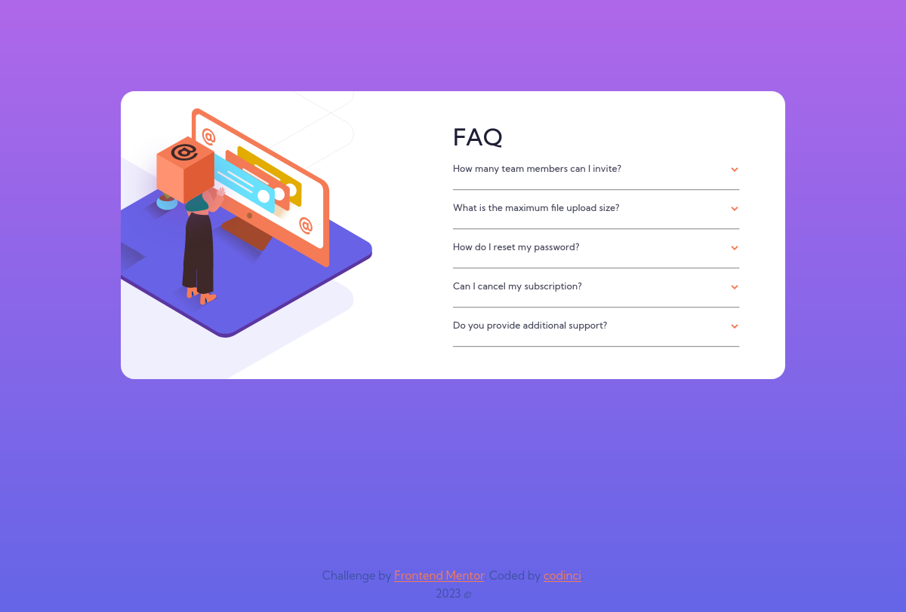

# Frontend Mentor - FAQ accordion card solution

This is a solution to the [FAQ accordion card challenge on Frontend Mentor](https://www.frontendmentor.io/challenges/faq-accordion-card-XlyjD0Oam). Frontend Mentor challenges help you improve your coding skills by building realistic projects.

## Table of contents

- [Overview](#overview)
  - [The challenge](#the-challenge)
  - [Screenshot](#screenshot)
  - [Links](#links)
- [My process](#my-process)
  - [Built with](#built-with)
  - [What I learned](#what-i-learned)
  - [Continued development](#continued-development)
  - [Useful resources](#useful-resources)
- [Author](#author)

**Note: Delete this note and update the table of contents based on what sections you keep.**

## Overview

### The challenge

Users should be able to:

- View the optimal layout for the component depending on their device's screen size
- See hover states for all interactive elements on the page
- Hide/Show the answer to a question when the question is clicked

### Screenshot
### Desktop View


### Mobile View


### Links

- Solution URL: [Github](https://github.com/codinci/FrontendChallenges/tree/main/faq-accordion-card-main)
- Live Site URL: [Github hosted pages](https://codinci.github.io/FrontendChallenges/faq-accordion-card-main/)

## My process

### Built with

- Semantic HTML5 markup
- CSS custom properties
- Flexbox
- Mobile-first workflow

### What I learned

 - Learnt on the usage of picture tag for display of images on different screen sizes

  ```html
    <picture>
      <source srcset="./images/illustration-woman-online-mobile.svg" media="(max-width: 760px)">
      
    </picture>
  ```

  - Learnt on the usage of css to display elements when clicked

  ```html
    <section class="card__item">
      <input type="checkbox" class="card__item-checkbox" id="toggle3">
      <label class="card__item-icon" for="toggle3">
        <h2 class="card__item-question">How do I reset my password?</h2>
        
      </label>
      <p class="card__item-response">
        Click “Forgot password” from the login page or “Change password”
        from your profile page. A reset link will be emailed to you.
      </p>
    </section>
  ```

  ```css
    /* Show the paragraph when the checkbox is checked */
    .card__item-checkbox:checked ~ .card__item-icon + .card__item-response {
        display: block;
    }

    /* Add a class to rotate the icon when the checkbox is checked */
    .card__item-checkbox:checked ~.card__item-icon .icon {
      transform: rotate(180deg);
    }

    /* Add a class to change the h2 color when the checkbox is checked */
    .card__item-checkbox:checked ~.card__item-icon h2 {
      color: var(--color-dark-blue);
    }
  ```

  - Learnt on positioning of an image
  ```css
    .card__image-main {
      transform: scale(.85, .85);
      position: relative;
      top: -15px;
      left: -110px;
    }
    .card__image-overlay {
      position: absolute;
      transform: scale(.85, .85);
      top: 165px;
      left: 150px;
      z-index: 99;
      overflow: visible;
    }
  ```

### Continued development

I'd like to learn more on relative vs absolute positioning, overflow and css selectors such as next sibling selector(+), child selector(>) and general sibling selector(~)

### Useful resources

- [W3 Schools](https://www.w3schools.com) - Helped me gain deeper understanding of css selectors and flex
- [Perficient](https://blogs.perficient.com/2021/02/25/how-to-show-hide-html-elements-by-only-using-css/) - This is an amazing article which helped me design on the selectors needed to toggle the display of answers using just css.


## Author

- Frontend Mentor - [codinci](https://www.frontendmentor.io/profile/codinci)
- Github - [codinci](https://github.com/codinci)

