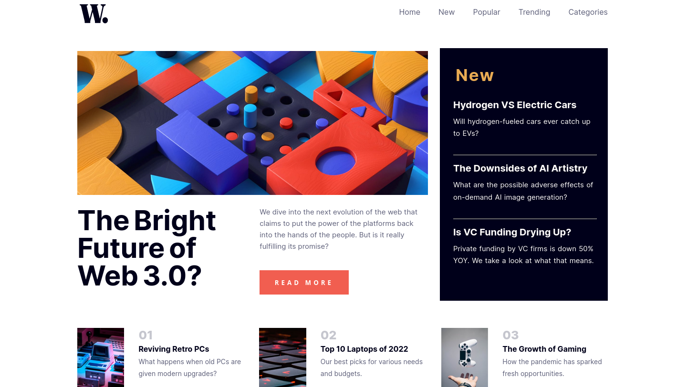

# Frontend Mentor - News homepage solution

This is a solution to the [News homepage challenge on Frontend Mentor](https://www.frontendmentor.io/challenges/news-homepage-H6SWTa1MFl). Frontend Mentor challenges help you improve your coding skills by building realistic projects.

## Table of contents

- [Overview](#overview)
  - [The challenge](#the-challenge)
  - [Screenshot](#screenshot)
  - [Links](#links)
- [My process](#my-process)
  - [Built with](#built-with)
  - [What I learned](#what-i-learned)
  - [Useful resources](#useful-resources)
- [Author](#author)
- [Acknowledgments](#acknowledgments)


## Overview

### The challenge

Users should be able to:

- View the optimal layout for the interface depending on their device's screen size
- See hover and focus states for all interactive elements on the page

### Screenshot

### Mobile View


### Desktop View




### Links

- Solution URL: [Github](https://github.com/codinci/FrontendChallenges/tree/main/news-homepage-main)
- Live Site URL: [Github Pages](https://codinci.github.io/FrontendChallenges/news-homepage-main/)

## My process

### Built with

- Semantic HTML5 markup
- SCSS custom properties
- Flexbox
- CSS Grid
- Mobile-first workflow

### What I learned

```scss
&__overlay {
    position: fixed;
    opacity: 0;
    width: 100%;
    height: 100%;
    top: 0;
    left: 0;
    right: 0;
    bottom: 0;
    background-color: rgba(0, 0, 0, 0.5);
    z-index: 2;
    cursor: pointer;
    transition: opacity .5s ease-in-out;
    pointer-events: none;
  }

  &__overlay.show {
    opacity: 1;
    pointer-events: auto;
  }

```
```js
window.addEventListener('load', () => {
	const loader = document.getElementById('loader')
	const header = document.getElementById('header')
	const main = document.getElementById('main')
	const footer = document.getElementById('footer')
	loader.style.display = 'none'
	header.style.display = 'flex'
	main.style.display = 'grid'
	footer.style.display = 'flex'
})
```

### Useful resources

- [Stack Overflow](https://stackoverflow.com/questions/68436334/how-to-display-animation-before-page-loads) - This helped me get javascript function to get page when it loads into view.

## Author

- Frontend Mentor - [codinci](https://www.frontendmentor.io/profile/codinci)
- Github - [codinci](https://github.com/codinci)

## Acknowledgments

- [Codepen](https://codepen.io/rajanchaudhari08/pen/xxQKMRa) - This is where I acquired the code to have a loader for before the page loads into view
