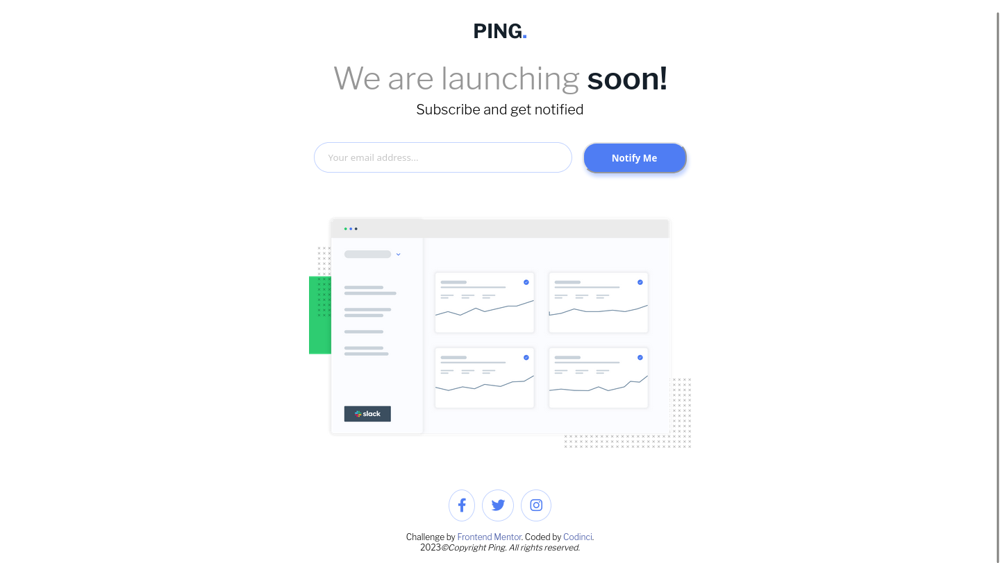
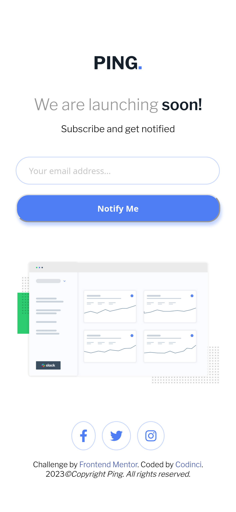

# Frontend Mentor - Ping coming soon page solution

This is a solution to the [Ping coming soon page challenge on Frontend Mentor](https://www.frontendmentor.io/challenges/ping-single-column-coming-soon-page-5cadd051fec04111f7b848da). Frontend Mentor challenges help you improve your coding skills by building realistic projects.

## Table of contents

- [Overview](#overview)
  - [The challenge](#the-challenge)
  - [Screenshot](#screenshot)
  - [Links](#links)
- [My process](#my-process)
  - [Built with](#built-with)
  - [What I learned](#what-i-learned)
  - [Continued development](#continued-development)
  - [Useful resources](#useful-resources)
- [Author](#author)

## Overview

### The challenge

Users should be able to:

- View the optimal layout for the site depending on their device's screen size
- See hover states for all interactive elements on the page
- Submit their email address using an `input` field
- Receive an error message when the `form` is submitted if:
	- The `input` field is empty. The message for this error should say *"Whoops! It looks like you forgot to add your email"*
	- The email address is not formatted correctly (i.e. a correct email address should have this structure: `name@host.tld`). The message for this error should say *"Please provide a valid email address"*

### Screenshot

### Desktop Version


### Mobile Version


### Links

- Solution URL: [Github](https://github.com/codinci/FrontendChallenges/tree/main/ping-coming-soon-page-master)
- Live Site URL: [Github hosted pages](https://codinci.github.io/FrontendChallenges/ping-coming-soon-page-master/)

## My process

### Built with

- Semantic HTML5 markup
- CSS custom properties
- Flexbox
- BEM
- Vanilla JavaScript

### What I learned
- Subcription form

```html
    <form id="subForm" class="subscription-form content__subscription-form" novalidate>
      <div class="subscription-form__email">
        <input type="email" id="emailInput" class="input" placeholder="Your email address...">
        <span id="inputMessage" class="message input__message">Please provide a valid email address</span>
      </div>
      <button id="submitBtn" type="submit" class="subscription-form__button">Notify Me</button>
    </form>
```

- Set height of input and button to align them
```css
  .input {
    height: 4.2rem;
    width: 350px;
    border-radius: 3rem;
    vertical-align: 1.5rem;
    padding-left: 2rem;
    color: var(--color-gray);
    border: 1px solid var(--color-pale-blue);
  }
```

- Form submission functionality
```js
  form.addEventListener('submit',(e) => {
    e.preventDefault();
    const emailValidation = /^[(\w\d\W)+]+@[\w+]+\.[\w+]+$/i;
    if (email.value === '') {
      toggleMessage('Whoops! It looks like you forgot to add your email','error');
    } else if (!emailValidation.test(email.value)) {
      toggleMessage('Please provide a valid email address','error');
    } else {
      toggleMessage('You will receive an email notification when site is up','success');
    }
  })
```

### Continued development

 - I'd like to learnn how to send an email to the backend and gather user statistics.
 - Develop a countdown to launch time.

### Useful resources

- [Mozilla](https://developer.mozilla.org/en-US/docs/Web/API/setTimeout) - This helped me better understand setTimeout global function

## Author

- Frontend Mentor - [codinci](https://www.frontendmentor.io/profile/codinci)
- Github - [codinci](https://github.com/codinci)


