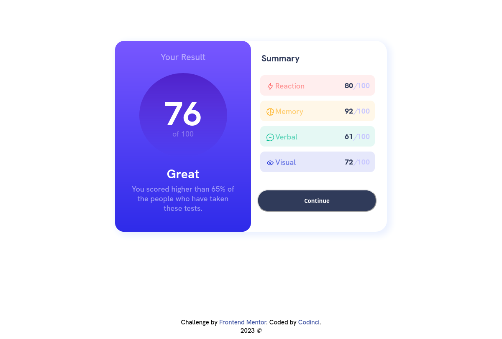
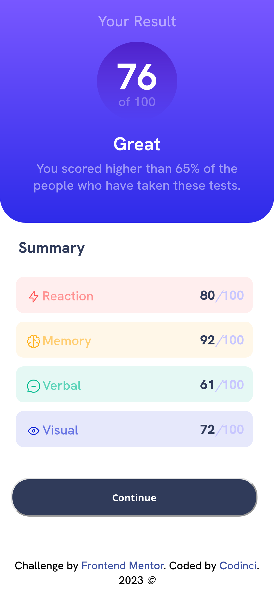

# Frontend Mentor - Results summary component solution

This is a solution to the [Results summary component challenge on Frontend Mentor](https://www.frontendmentor.io/challenges/results-summary-component-CE_K6s0maV). Frontend Mentor challenges help you improve your coding skills by building realistic projects.

## Table of contents

- [Overview](#overview)
  - [The challenge](#the-challenge)
  - [Screenshot](#screenshot)
  - [Links](#links)
- [My process](#my-process)
  - [Built with](#built-with)
  - [What I learned](#what-i-learned)
  - [Continued development](#continued-development)
  - [Useful resources](#useful-resources)
- [Author](#author)

## Overview

### The challenge

Users should be able to:

- View the optimal layout for the interface depending on their device's screen size
- See hover and focus states for all interactive elements on the page
- **Bonus**: Use the local JSON data to dynamically populate the content

### Screenshot
### Desktop View


### Mobile View

### Links

- Solution URL: [Github](https://github.com/codinci/FrontendChallenges/tree/main/results-summary-component-main)
- Live Site URL: [Github hosted pages](https://codinci.github.io/FrontendChallenges/results-summary-component-main/)
## My process

### Built with

- Semantic HTML5 markup
- CSS custom properties
- Flexbox
- [BEM](https://en.bem.info/methodology/quick-start/) - BEM naming convention

### What I learned

- Learnt on the use of BEM naming conventions and styling.
```html
<body class="page">
  <main class="content page__content">
    <section class="result">
      <h3 class="result-header result__header">Your Result</h3>
```

- Refreshed on vanilla javascript and use of forEach
```js
data.forEach(elem => {
	// convert the category data attribute to lower case
	const categoryName = elem.category.toLowerCase();
	// create a ratings element
	const ratingsElem = document.createElement('div');
```

- Proud of this css used to align icons and text
```css
.icon{
	position: relative;
	top: 5px;
	bottom: 5px;
}
```
### Continued development

I'd like to learn more on the BEM naming convention and build more projects via this convention.

### Useful resources

Always make google your friend!

## Author

- Frontend Mentor - [codinci](https://www.frontendmentor.io/profile/codinci)
- Github - [codinci](https://github.com/codinci)

