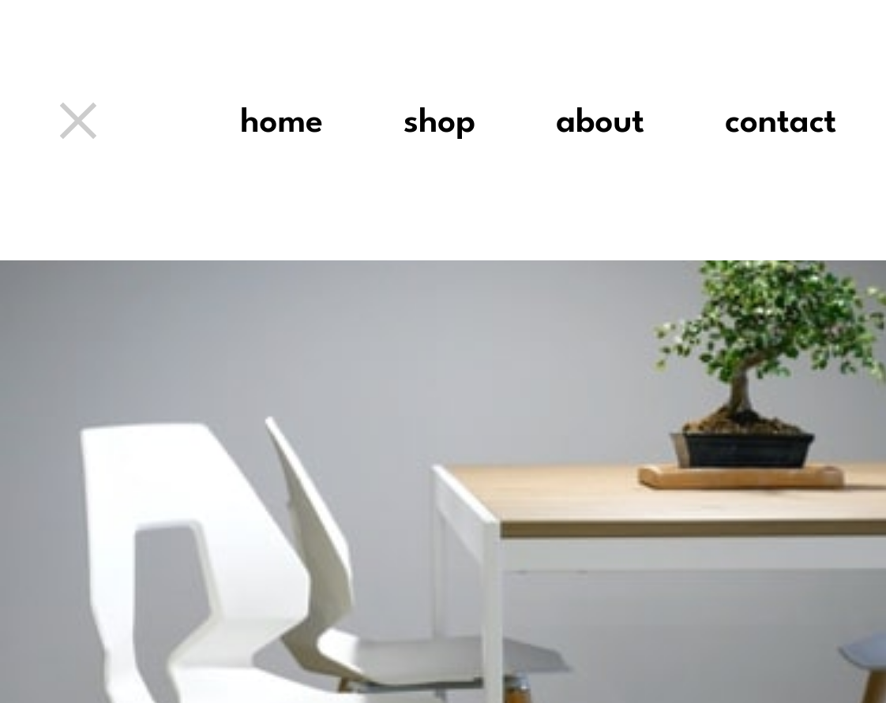

# Frontend Mentor - Room homepage solution

This is a solution to the [Room homepage challenge on Frontend Mentor](https://www.frontendmentor.io/challenges/room-homepage-BtdBY_ENq). Frontend Mentor challenges help you improve your coding skills by building realistic projects.

## Table of contents

- [Overview](#overview)
  - [The challenge](#the-challenge)
  - [Screenshot](#screenshot)
  - [Links](#links)
- [My process](#my-process)
  - [Built with](#built-with)
  - [What I learned](#what-i-learned)
  - [Continued development](#continued-development)
  - [Useful resources](#useful-resources)
- [Author](#author)

## Overview

### The challenge

Users should be able to:

- View the optimal layout for the site depending on their device's screen size
- See hover states for all interactive elements on the page
- Navigate the slider using either their mouse/trackpad or keyboard

### Screenshot

- Desktop View


- Mobile View


- Mobile Navbar View


Add a screenshot of your solution. The easiest way to do this is to use Firefox to view your project, right-click the page and select "Take a Screenshot". You can choose either a full-height screenshot or a cropped one based on how long the page is. If it's very long, it might be best to crop it.

Alternatively, you can use a tool like [FireShot](https://getfireshot.com/) to take the screenshot. FireShot has a free option, so you don't need to purchase it.

Then crop/optimize/edit your image however you like, add it to your project, and update the file path in the image above.


### Links

- Solution URL: [Github](https://github.com/codinci/FrontendChallenges/tree/main/room-homepage-master)
- Live Site URL: [Github Pages](https://codinci.github.io/FrontendChallenges/room-homepage-master/)

## My process

### Built with

- Semantic HTML5 markup
- SCSS custom properties
- CSS Grid
- Mobile-first workflow
- Vanilla Javascript

### What I learned

- Learnt about scss

```_footer.scss
$color-very-dark-gray: hsl(0, 0%, 27%);
$color-dark-gray: hsl(0, 0%, 63%);

.footer {
	display: flex;
	flex-direction: column;
	justify-content: center;
	margin: 1.5rem auto;
	grid-column: 1/5;
	grid-row: 5;
	&__attribution {
		text-align: center;
	}
	&__copyright {
		text-align: center;
		padding-top: .5rem;
	}
}

.footer-attribution {
	&__link {
		text-decoration: none;
		color: $color-dark-gray;
		font-weight: 600;
		&:hover {
			cursor: pointer;
			color: $color-very-dark-gray;
		}
	}

}
```

- Learnt about CSS grid

```_typography.scss
body {
	font-family: $font-family;
	font-weight: 500;
	max-height: 100dvh;
	font-size: 1.2rem;
	display: grid;
	grid-template-columns: repeat(4, 1fr);
	grid-template-rows:repeat(4, 1fr) ;
}
```
- Learnt on keyboard events

```slider.js
keyBoardInput() {
		document.addEventListener('keydown', (event) => {
				switch (event.key) {
					case 'ArrowLeft':
						this.slideSetup(null, 'prev')
						break
					case 'ArrowRight':
						this.slideSetup(null, 'next')
						break
					default:
						break
				}
		})
	}
```

### Continued development
- Learn how to create animations and transitions to crete smoother animated effects.

### Useful resources
- [Mozilla](https://developer.mozilla.org/en-US/docs) - This helped me understand different javascript functions and events

## Author

- Frontend Mentor - [codinci](https://www.frontendmentor.io/profile/codinci)
- Github - [codinci](https://github.com/codinci)